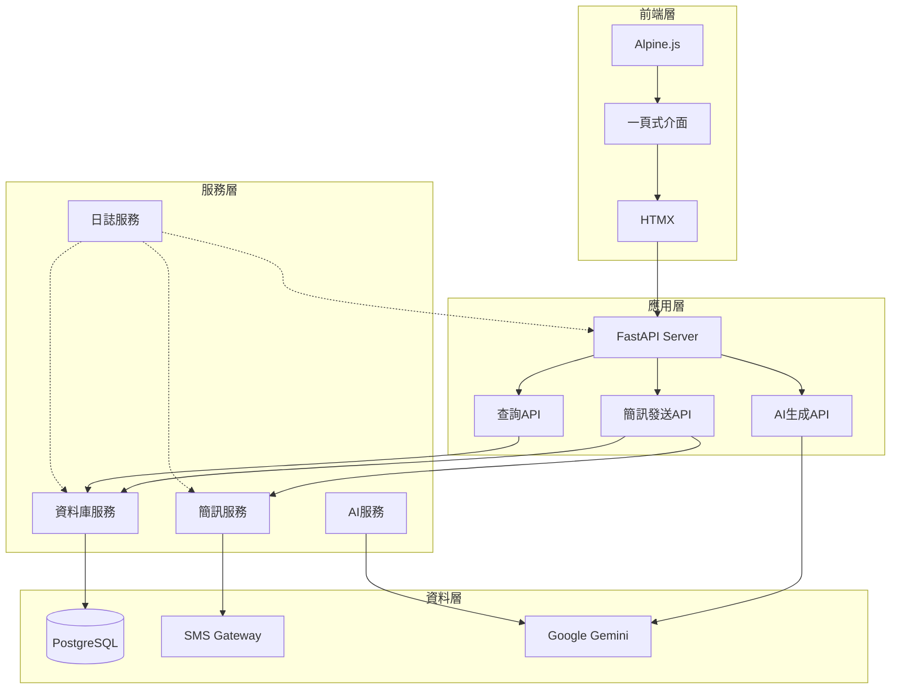

# 簡訊發送系統 (SMS System)

一個基於 FastAPI 的一頁式簡訊發送應用程式，支援 AI 生成簡訊、自然語言查詢客戶資料、預約發送等功能。

## 系統特色

- 🤖 **AI 簡訊生成**：使用 Google Gemini API 根據提示詞生成促銷簡訊
- 🔍 **自然語言查詢**：透過自然語言查詢客戶資料，自動轉換為 SQL
- 📱 **簡訊發送**：支援立即發送和預約發送
- 📊 **客戶管理**：整合客戶資料查詢與篩選
- 🔐 **個資保護**：自動隱碼處理敏感個資
- ⚡ **即時回饋**：即時字數統計與驗證
- 🔄 **定時任務**：自動處理排程簡訊

## 技術架構

- **後端**：FastAPI (Python)
- **資料庫**：PostgreSQL
- **前端**：HTML + HTMX + Alpine.js + Tailwind CSS
- **AI 服務**：Google Gemini API
- **簡訊服務**：外部 SMS Gateway

## 系統架構圖



## 快速開始

### 環境需求

- Python 3.8+
- PostgreSQL 12+
- Google Gemini API Key

### 安裝步驟

1. **複製專案**
```bash
git clone <repository-url>
cd sms_system
```

2. **建立虛擬環境**
```bash
python -m venv venv
source venv/bin/activate  # Linux/Mac
# 或
venv\Scripts\activate  # Windows
```

3. **安裝依賴**
```bash
pip install -r requirements.txt
```

4. **設定環境變數**
```bash
cp .env.example .env
# 編輯 .env 檔案，填入必要的設定
```

5. **設定資料庫**
```bash
# 建立資料庫
createdb sms_system

# 執行初始化腳本
psql -d sms_system -f init_database.sql

# 載入測試資料
psql -d sms_system -f sample_data.sql
```

6. **啟動系統**
```bash
python main.py
```

系統將在 http://localhost:8000 啟動

## 環境變數設定

複製 `.env.example` 為 `.env` 並設定以下參數：

```bash
# 資料庫設定
DB_HOST=localhost
DB_PORT=5432
DB_NAME=sms_system
DB_USER=postgres
DB_PASSWORD=your_password

# FastAPI設定
API_HOST=0.0.0.0
API_PORT=8000
DEBUG=false

# SMS Gateway設定
SMS_GATEWAY_URL=http://123.123.123.123:4321/mpsiweb/smssubmit
SMS_SYS_ID=ENT001
SMS_SRC_ADDRESS=01234500000000001234
SMS_DR_FLAG=true
SMS_FIRST_FAIL_FLAG=false

# Gemini API設定
GEMINI_API_KEY=your-gemini-api-key

# 日誌設定
LOG_LEVEL=INFO
LOG_FILE=logs/sms_system.log
LOG_MAX_SIZE=10485760
LOG_BACKUP_COUNT=5

# 排程設定
SCHEDULE_INTERVAL=60
```

## 使用說明

### 1. AI 生成簡訊

1. 選擇「AI生成簡訊」模式
2. 輸入提示詞（例如：「週年慶促銷活動」）
3. 點擊「生成簡訊」
4. 系統會自動生成符合長度限制的促銷簡訊

### 2. 自定義簡訊

1. 選擇「自定義簡訊」模式
2. 直接輸入簡訊內容
3. 系統會即時顯示字數統計

### 3. 客戶查詢

1. 在「客戶查詢」區塊輸入自然語言查詢
2. 例如：「找出最近一個月有購買的客戶」
3. 系統會自動轉換為 SQL 並顯示結果
4. 可勾選客戶加入收件人清單

### 4. 發送簡訊

1. 選擇「立即發送」或「預約發送」
2. 如選擇預約發送，設定發送時間
3. 確認收件人清單
4. 點擊「發送」按鈕

## API 文件

### 簡訊相關 API

#### 生成簡訊
```http
POST /api/generate-sms
Content-Type: application/x-www-form-urlencoded

prompt=週年慶促銷活動&max_length=70
```

#### 驗證簡訊長度
```http
POST /api/validate-sms
Content-Type: application/x-www-form-urlencoded

content=簡訊內容&max_length=70
```

#### 排程簡訊
```http
POST /api/schedule-sms
Content-Type: application/x-www-form-urlencoded

message_class=SCHEDULED&message_body=簡訊內容&recipient_no=0912345678&schedule_date=2024-01-01T10:00:00
```

### 查詢相關 API

#### 解析自然語言查詢
```http
POST /api/parse-query
Content-Type: application/x-www-form-urlencoded

query=找出最近一個月有購買的客戶
```

#### 執行客戶查詢
```http
POST /api/query-customers
Content-Type: application/x-www-form-urlencoded

sql_query=SELECT * FROM public."custInfo" LIMIT 10
```

## 專案結構

```
sms_system/
├── config/
│   ├── settings.py          # 系統設定
│   └── database.py          # 資料庫連線設定
├── modules/
│   ├── db_handler.py        # 資料庫操作模組
│   ├── sms_gateway.py       # SMS Gateway模組
│   └── ai_service.py        # AI服務模組
├── templates/
│   └── index.html          # 主頁面模板
├── static/
│   ├── css/                # 樣式檔案
│   └── js/                 # JavaScript檔案
├── tests/
│   ├── test_db_handler.py  # 資料庫測試
│   ├── test_sms_gateway.py # SMS Gateway測試
│   └── test_ai_service.py  # AI服務測試
├── logs/                   # 日誌檔案
├── main.py                 # FastAPI主程式
├── requirements.txt        # 依賴套件
├── pytest.ini             # 測試設定
├── init_database.sql      # 資料庫初始化
├── sample_data.sql        # 測試資料
├── .env.example           # 環境變數範例
└── README.md             # 專案說明
```

## 測試

執行測試套件：

```bash
# 執行所有測試
pytest

# 執行特定測試
pytest tests/test_db_handler.py
pytest tests/test_sms_gateway.py
pytest tests/test_ai_service.py

# 執行測試並顯示詳細資訊
pytest -v

# 執行測試並產生覆蓋率報告
pytest --cov=modules tests/
```

## 部署

### Docker 部署（建議）

1. **建立 Dockerfile**
```dockerfile
FROM python:3.9-slim

WORKDIR /app

COPY requirements.txt .
RUN pip install -r requirements.txt

COPY . .

CMD ["uvicorn", "main:app", "--host", "0.0.0.0", "--port", "8000"]
```

2. **建立 docker-compose.yml**
```yaml
version: '3.8'
services:
  web:
    build: .
    ports:
      - "8000:8000"
    environment:
      - DB_HOST=db
      - DB_NAME=sms_system
      - DB_USER=postgres
      - DB_PASSWORD=postgres
    depends_on:
      - db
  
  db:
    image: postgres:13
    environment:
      - POSTGRES_DB=sms_system
      - POSTGRES_USER=postgres
      - POSTGRES_PASSWORD=postgres
    volumes:
      - postgres_data:/var/lib/postgresql/data
      - ./init_database.sql:/docker-entrypoint-initdb.d/init.sql
      - ./sample_data.sql:/docker-entrypoint-initdb.d/sample.sql

volumes:
  postgres_data:
```

3. **啟動服務**
```bash
docker-compose up -d
```

### 生產環境部署

1. **使用 Gunicorn**
```bash
pip install gunicorn
gunicorn main:app -w 4 -k uvicorn.workers.UvicornWorker --bind 0.0.0.0:8000
```

2. **使用 systemd 服務**
```ini
# /etc/systemd/system/sms-system.service
[Unit]
Description=SMS System
After=network.target

[Service]
Type=exec
User=sms
WorkingDirectory=/opt/sms_system
Environment="PATH=/opt/sms_system/venv/bin"
ExecStart=/opt/sms_system/venv/bin/gunicorn main:app -w 4 -k uvicorn.workers.UvicornWorker --bind 0.0.0.0:8000
Restart=always

[Install]
WantedBy=multi-user.target
```

## 開發過程記錄

### 第1天：系統分析與設計
- 完成系統需求分析
- 設計資料庫架構
- 建立系統架構圖和時序圖

### 第2天：基礎建設
- 建立專案結構
- 設定開發環境
- 建立資料庫連線模組

### 第3天：核心功能開發
- 實作 SMS Gateway 模組
- 實作 AI 服務模組
- 建立 FastAPI 路由

### 第4天：前端開發
- 建立一頁式介面
- 整合 HTMX 和 Alpine.js
- 實作即時互動功能

### 第5天：測試與優化
- 建立測試案例
- 優化使用者體驗
- 撰寫文件

## 常見問題

### Q1: 如何設定 Google Gemini API？
A: 前往 [Google AI Studio](https://makersuite.google.com/app/apikey) 申請 API Key，並在 `.env` 檔案中設定 `GEMINI_API_KEY`。

### Q2: 資料庫連線失敗怎麼辦？
A: 檢查以下項目：
- PostgreSQL 是否正在執行
- 資料庫名稱、使用者名稱、密碼是否正確
- 防火牆是否允許連線

### Q3: SMS Gateway 連線失敗？
A: 檢查：
- SMS Gateway URL 是否正確
- 網路連線是否正常
- 認證資訊是否正確

### Q4: 如何新增更多客戶資料？
A: 可以直接在資料庫中插入資料，或使用系統提供的查詢功能篩選現有客戶。

## 授權

本專案採用 MIT 授權條款，詳見 [LICENSE](LICENSE) 檔案。

## 聯絡資訊

如有問題或建議，請透過以下方式聯絡：
- Email: support@sms-system.com
- GitHub Issues: [專案Issues頁面](https://github.com/your-repo/sms-system/issues)

## 更新日誌

### v1.0.0 (2024-01-28)
- 初始版本發布
- 支援 AI 簡訊生成
- 支援自然語言查詢
- 支援預約發送
- 完整的測試覆蓋